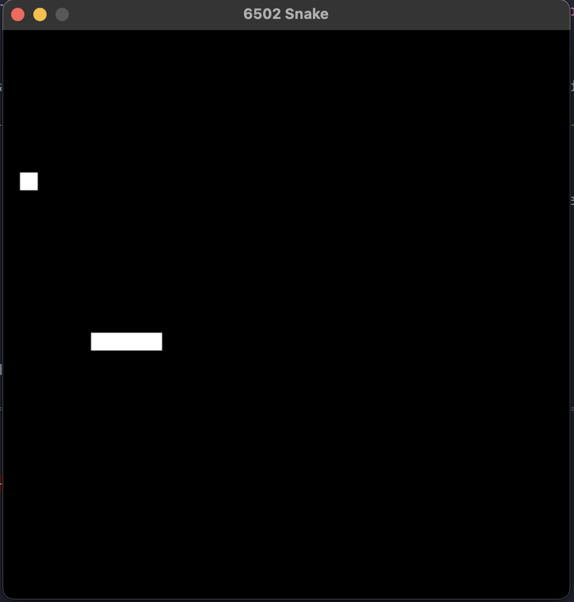

# 6502 Emulator

This is a simple 6502 microprocessor emulator written in C++. It is capable of running simple programs, and comes with a snake game.



## Features

*   Implements the whole 6502 instruction set.
*   64KB of addressable memory.
*   Basic memory-mapped I/O for keyboard input and random number generation.
*   SDL2-based frontend for displaying a 32x32 pixel screen.

## Building and Running

### Prerequisites

*   A C++ compiler that supports C++11 (e.g., g++, clang++)
*   SDL2 library

### Building

To build the emulator, run the following command:

```bash
make
```

This will create an executable file named `emu` in the `build/bin` directory.

### Running

To run the emulator with the default snake game, run the following command:

```bash
./build/bin/emu
```

You can also provide a path to a custom ROM file as a command-line argument:

```bash
./build/bin/emu path/to/your/rom.bin
```

## Usage

*   **W, A, S, D:** Control the snake's direction.
*   **Escape:** Quit the emulator.

## Folder Structure

```
.
├── Makefile
├── build/
├── include/
│   ├── cpu.h
│   └── frontend.h
└── src/
    ├── cpu.cpp
    ├── frontend.cpp
    └── main.cpp
```

*   `Makefile`: Contains the build instructions for the project.
*   `build/`: This directory is created by the build process and contains the object files and the final executable.
*   `include/`: Contains the header files for the project.
*   `src/`: Contains the source code for the project.
